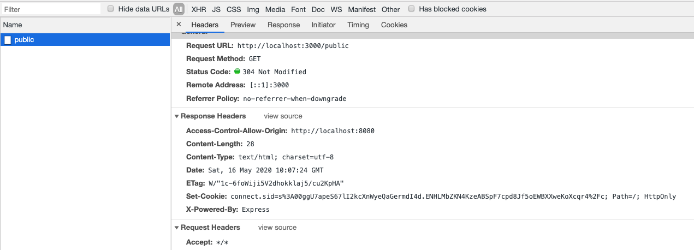
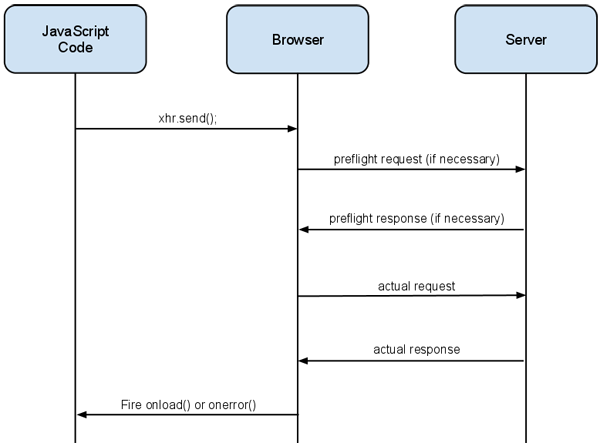

# WebDevNotes

## Understanding and Experimenting CORS

Thanks to 
[understanding cors](https://dev.to/g33konaut/understanding-cors-aaf)
[expressjs-cors](https://expressjs.com/en/resources/middleware/cors.html)
[html5rocks-cors](https://html5rocks.com/en/tutorials/cors/)

> [Cross-Origin Resource Sharing](http://www.w3.org/TR/cors/) (CORS) is a W3C spec that allows cross-domain communication from the browser. 

Highlightes:

1. The browser enforces the Same-origin policy to avoid getting responses from websites that do not share the same origin.
2. The Same-origin policy does not prevent requests being made to other origins, but disables access to the response from JavaScript.
3. Since the requests are still made to the other origins this doesn't enforce a safety for the server. Als, using browser plugins users can still inject these headers to make the response available to them.
4. CORS headers allow access to cross-origin responses.
5. CORS together with credentials require caution.


To experiment lets consider 2 web applications

a) ACME Corp - an API provider

b) Some Client - who wants to use the API


### ACME Corp

A server running on 3000.

Files:

- index.js		 - exposes endpoints and a page for testing
- index.html	- page for testing


```javascript
//index.js
var express = require('express')
var bodyParser = require('body-parser')
var session = require('express-session')
var path = require('path')
var app = express()

app.use(function(req, res, next) {
  const { rawHeaders, method, url } = req;

  console.log(
    JSON.stringify({
      timestamp: Date.now(),
      rawHeaders,
      method,
      url
    })
  );
  next();
});

var privateData = 'Secret data'

app.use(bodyParser.json())

app.use(session({
  secret: 'ThisIsNotSafe',
  resave: true,
  saveUninitialized: true
}))

// viewed at http://localhost:3000
app.get('/', function (req, res) {
  res.sendFile(path.join(__dirname + '/index.html'));
});

app.get('/public', function (req, res) {
  console.log("public api hit");
  res.send(JSON.stringify({
    message: 'This is public'
  }));
})


app.listen(process.env.PORT || 3000)
```

```html
<!doctype html>
<html>

<body>
  <h1>ACME Corp. API Provider Home</h1>
  <p>
    <button id="ajax">Ajax</button>
    <button id="fetch">Fetch</button>
  </p>
  <script>
    //CORS request using fetch API
    var url = 'http://localhost:3000/public';
    document.querySelector('#fetch').addEventListener('click', function () {
      fetch(url, {
        method: 'get',
      })
        .then(response => response.text())
        .then((result) => {
          console.log(result);
          alert('Response from CORS request to ' + url + ': ' + result);
        })
    });
		
    // CORS request using XHR object
    // Create the XHR object.
    function createCORSRequest(method, url) {
      var xhr = new XMLHttpRequest();
      if ("withCredentials" in xhr) {
        // XHR for Chrome/Firefox/Opera/Safari.
        xhr.open(method, url, true);
      } else if (typeof XDomainRequest != "undefined") {
        // XDomainRequest for IE.
        xhr = new XDomainRequest();
        xhr.open(method, url);
      } else {
        // CORS not supported.
        xhr = null;
      }
      return xhr;
    }

    // Make the actual CORS request.
    function makeCorsRequest() {
      var xhr = createCORSRequest('GET', url);
      if (!xhr) {
        alert('CORS not supported');
        return;
      }
      // Response handlers.
      xhr.onload = function () {
        var result = xhr.responseText;
        console.log(result);
        alert('Response from CORS request to ' + url + ': ' + result);
      };
      xhr.onerror = function () {
        alert('Woops, there was an error making the request.');
      };
      xhr.send();
    }
    document.querySelector('#ajax').addEventListener('click', function () {
      makeCorsRequest();
    });

  </script>
</body>

</html>
```


Note few things like there is one endpoint `/public` as of now. 

CORS applies to only calls from javascript API specifically -

- XHR requests (AJAX)
- Fetch API

### Some Client

A server running on 8080.

Files:

- app.js			- a very simple server that exposes their home page
- app.html      - the home page (with buttons to invoke the ACME's API)

```javascript
var express = require('express');
var app = express();
var path = require('path');

// viewed at http://localhost:8080
app.get('/', function (req, res) {
  res.sendFile(path.join(__dirname + '/app.html'));
});


app.listen(8080);
```

```html
<!doctype html>
<html>

<body>
  <h1>Client Home</h1>
  <p>Client's friend ACME Corp. has allowed us to use his API</p>
  <p>API endpoints provided: </p>
  <p>
    <button id="ajax">Ajax</button>
    <button id="fetch">Fetch</button>
  </p>
  <script>
    // CORS request using Fetch API
    // This is a sample server that supports CORS.
    var url = 'http://localhost:3000/public';
    document.querySelector('#fetch').addEventListener('click', function () {
      fetch(url, {
        method: 'get',
      })
        .then(response => response.text())
        .then((result) => {
          console.log(result);
          alert('Response from CORS request to ' + url + ': ' + result);
        })
    });
    // CORS request using XHR object
    // Create the XHR object.
    function createCORSRequest(method, url) {
      var xhr = new XMLHttpRequest();
      if ("withCredentials" in xhr) {
        // XHR for Chrome/Firefox/Opera/Safari.
        xhr.open(method, url, true);
      } else if (typeof XDomainRequest != "undefined") {
        // XDomainRequest for IE.
        xhr = new XDomainRequest();
        xhr.open(method, url);
      } else {
        // CORS not supported.
        xhr = null;
      }
      return xhr;
    }

    // Make the actual CORS request.
    function makeCorsRequest() {

      var xhr = createCORSRequest('GET', url);
      if (!xhr) {
        alert('CORS not supported');
        return;
      }

      // Response handlers.
      xhr.onload = function () {
        var result = xhr.responseText;
        console.log(result);
        alert('Response from CORS request to ' + url + ': ' + result);
      };

      xhr.onerror = function () {
        alert('Woops, there was an error making the request.');
      };

      xhr.send();
    }
    document.querySelector('#ajax').addEventListener('click', function () {
      makeCorsRequest();
    });

  </script>
</body>

</html>
```


Now, if you run both the servers and test you will notice that from client you are not able to make requests to ACME's API.


The request was successful, but the result was not available.

The browser make the request from the wire available to the page only if there are appropriate headers from the API's response. The most important being  `Access-Control-Allow-Origin` .

### Same Origin Policy

The reason why we won't get the response in JavaScript is the *Same-Origin Policy*. This policy was aimed at making sure that a website can't read the result from a request made to another website and is enforced by the browser.

The "origin" in this case is composed from

- the protocol (e.g. `http`)
- the host (e.g. `example.com`)
- the port (e.g. `8000`)

So `http://example.org` and `http://www.example.org` and `https://example.org` are three different origins.

### Enabling CORS

```javascript
var whitelist = 'http://localhost:8080,http://anotherclient.com';

let allowCrossDomain = function(req, res, next) {
  var allowedOrigins = whitelist.split(',');
  let origin = req.headers.origin;
  console.log("Allowed: ",allowedOrigins);
  console.log("Origin: ", origin);
  if (allowedOrigins.indexOf(origin) > -1) {
    res.setHeader('Access-Control-Allow-Origin', origin);
  }  
  next();
}

app.use(allowCrossDomain);
```

Here we are setting the `Access-Control-Allow-Origin` header to the requesting URL `http://localhost:8080` which means: Client host is allowed to access this URL and the response in the browser:



### Not so simple requests

If the client makes a change to it's code like,

```javascript
fetch(url, {
        method: 'get',
        headers: {
          'Content-Type': 'application/json'
        }
      })
```


If you test it you will notice that this again breaks.

Why did it fail? Why is it called a not so simple request?

Cross-origin requests come in two flavors:

1. simple requests
2. Not-so-simple requests

Simple requests are requests that meet the following criteria:

- HTTP Method matches (case-sensitive) one of:
  - HEAD
  - GET
  - POST
- HTTP Headers matches (case-insensitive):
  - Accept
  - Accept-Language
  - Content-Language
  - Last-Event-ID
  - Content-Type, but only if the value is one of:
    - application/x-www-form-urlencoded
    - multipart/form-data
    - text/plain

Simple requests are characterized as such because they can already be made from a browser without using CORS. For example, a JSON-P request can issue a cross-domain GET request. Or HTML could be used to do a form POST.

Any request that does not meet the criteria above is a not-so-simple request, and requires a little extra communication between the browser and the server called a *preflight request*.



Let's add the following to make the API server capable to handle this.

```javascript
    res.setHeader('Access-Control-Allow-Methods', 'GET, OPTIONS');
    res.setHeader('Access-Control-Allow-Headers', 'Content-Type');
```

Once added, you will notice that client is able to make successful calls. Make sure to clear your browser cache.

If you notice the logs - you will find the preflight OPTIONS request.

```json
{"timestamp":1589624221765,"rawHeaders":["Host","localhost:3000","Connection","keep-alive","Accept","*/*","Access-Control-Request-Method","GET","Access-Control-Request-Headers","content-type","Origin","http://localhost:8080","Sec-Fetch-Mode","cors","Sec-Fetch-Site","same-site","Sec-Fetch-Dest","empty","Referer","http://localhost:8080/","User-Agent","Mozilla/5.0 (Macintosh; Intel Mac OS X 10_14_6) AppleWebKit/537.36 (KHTML, like Gecko) Chrome/81.0.4044.138 Safari/537.36","Accept-Encoding","gzip, deflate, br","Accept-Language","en-US,en;q=0.9,ml;q=0.8"],"method":"OPTIONS","url":"/public"}

Allowed:  [ 'http://localhost:8080', 'http://anotherclient.com' ]
Origin:  http://localhost:8080

{"timestamp":1589624221783,"rawHeaders":["Host","localhost:3000","Connection","keep-alive","User-Agent","Mozilla/5.0 (Macintosh; Intel Mac OS X 10_14_6) AppleWebKit/537.36 (KHTML, like Gecko) Chrome/81.0.4044.138 Safari/537.36","Content-Type","application/json","Accept","*/*","Origin","http://localhost:8080","Sec-Fetch-Site","same-site","Sec-Fetch-Mode","cors","Sec-Fetch-Dest","empty","Referer","http://localhost:8080/","Accept-Encoding","gzip, deflate, br","Accept-Language","en-US,en;q=0.9,ml;q=0.8"],"method":"GET","url":"/public"}

Allowed:  [ 'http://localhost:8080', 'http://anotherclient.com' ]
Origin:  http://localhost:8080

public api hit
```

Things to note:

- Say, there is are secure endpoints with ACME that are accessible only after authentication. 

  - But even if you have authenticated against ACME on tab/window, those cookies won't get sent as part of CORS request.
  - ACME can allow this by setting `Access-Control-Allow-Credentials`

  ```javascript
  res.set('Access-Control-Allow-Credentials', 'true')
  res.set('Access-Control-Allow-Origin', req.headers.origin)
  ```

  - this is not a good practice	

- To know more about this - https://dev.to/g33konaut/understanding-cors-aaf
- If you want to use express module for ease of use - https://expressjs.com/en/resources/middleware/cors.html


### Those special headers

All CORS related headers are prefixed with "Access-Control-". 

Here’s some more details about each header.

`Access-Control-Allow-Origin` (required) - This header must be included in all valid CORS responses; omitting the header will cause the CORS request to fail. The value of the header can either echo the Origin request header (as in the example above), or be a '*' to allow requests from any origin. If you’d like any site to be able to access your data, using '*' is fine. But if you’d like finer control over who can access your data, use an actual value in the header.

`Access-Control-Allow-Methods` (optional) - Comma-delimited list of the supported HTTP methods. Note that although the preflight request only asks permisions for a single HTTP method, this reponse header can include the list of all supported HTTP methods. 

`Access-Control-Allow-Headers` (optional) - Comma-delimited list of the supported request headers.

`Access-Control-Allow-Credentials` (optional) - By default, cookies are not included in CORS requests. Use this header to indicate that cookies should be included in CORS requests. The only valid value for this header is `true` (all lowercase). If you don't need cookies, don't include this header (rather than setting its value to `false`).

The Access-Control-Allow-Credentials header works in conjunction with the [withCredentials property](https://www.html5rocks.com/en/tutorials/cors/#toc-withcredentials) on the XMLHttpRequest 2 object. Both these properties must be set to `true` in order for the CORS request to succeed. If .withCredentials is `true`, but there is no `Access-Control-Allow-Credentials` header, the request will fail (and vice versa).

Again, Its recommended that you don’t set this header unless you are sure you want cookies to be included in CORS requests.

`Access-Control-Expose-Headers` (optional) - The XMLHttpRequest 2 object has a getResponseHeader() method that returns the value of a particular response header. During a CORS request, the getResponseHeader() method can only access simple response headers. Simple response headers are defined as follows:

- Cache-Control
- Content-Language
- Content-Type
- Expires
- Last-Modified
- Pragma

If you want clients to be able to access other headers, you have to use the `Access-Control-Expose-Headers` header. The value of this header is a comma-delimited list of response headers you want to expose to the client.

### Those very special headers

Like the simple request, the browser adds the Origin header to every request, including the preflight. The preflight request is made as an HTTP OPTIONS request (so be sure your server is able to respond to this method). It also contains a few additional headers:

`Access-Control-Request-Method` - The HTTP method of the actual request. This request header is always included, even if the HTTP method is a simple HTTP method as defined earlier (GET, POST, HEAD).

`Access-Control-Request-Headers` - A comma-delimited list of non-simple headers that are included in the request.

The preflight request is a way of asking permissions for the actual request, before making the actual request. The server should inspect the two headers above to verify that both the HTTP method and the requested headers are valid and accepted.

If the HTTP method and headers are valid, the server should respond with the following:

Preflight Request:

```
OPTIONS /cors HTTP/1.1
Origin: http://api.bob.com
Access-Control-Request-Method: PUT
Access-Control-Request-Headers: X-Custom-Header
Host: api.alice.com
Accept-Language: en-US
Connection: keep-alive
User-Agent: Mozilla/5.0...
```

Preflight Response:

```
Access-Control-Allow-Origin: http://api.bob.com
Access-Control-Allow-Methods: GET, POST, PUT
Access-Control-Allow-Headers: X-Custom-Header
Content-Type: text/html; charset=utf-8
```

`Access-Control-Allow-Origin` (required) - Like the simple response, the preflight response must include this header.

`Access-Control-Allow-Methods` (required) - Comma-delimited list of the supported HTTP methods. Note that although the preflight request only asks permisions for a single HTTP method, this reponse header can include the list of all supported HTTP methods. This is helpful because the preflight response may be cached, so a single preflight response can contain details about multiple request types.

`Access-Control-Allow-Headers` (required if the request has an `Access-Control-Request-Headers` header) - Comma-delimited list of the supported request headers. Like the `Access-Control-Allow-Methods` header above, this can list all the headers supported by the server (not only the headers requested in the preflight request).

`Access-Control-Allow-Credentials` (optional) - Same as simple request.

`Access-Control-Max-Age` (optional) - Making a preflight request on *every* request becomes expensive, since the browser is making two requests for every client request. The value of this header allows the preflight response to be cached for a specified number of seconds.

Once the preflight request gives permissions, the browser makes the actual request. The actual request looks like the simple request, and the response should be processed in the same way:

Actual Request:

```
PUT /cors HTTP/1.1
Origin: http://api.bob.com
Host: api.alice.com
X-Custom-Header: value
Accept-Language: en-US
Connection: keep-alive
User-Agent: Mozilla/5.0...
```

Actual Response:

```
Access-Control-Allow-Origin: http://api.bob.com
Content-Type: text/html; charset=utf-8
```

If the server wants to deny the CORS request, it can just return a generic response (like HTTP 200), without any CORS header. The server may want to deny the request if the HTTP method or headers requested in the preflight are not valid. Since there are no CORS-specific headers in the response, the browser assumes the request is invalid, and doesn’t make the actual request:

Preflight Request:

```
OPTIONS /cors HTTP/1.1
Origin: http://api.bob.com
Access-Control-Request-Method: PUT
Access-Control-Request-Headers: X-Custom-Header
Host: api.alice.com
Accept-Language: en-US
Connection: keep-alive
User-Agent: Mozilla/5.0...
```

Preflight Response:

```
// ERROR - No CORS headers, this is an invalid request!
Content-Type: text/html; charset=utf-8
```

If there is an error in the CORS request, the browser will fire the client's `onerror` event handler. It will also print the following error to the console log:

```
XMLHttpRequest cannot load http://api.alice.com. Origin http://api.bob.com is not allowed by Access-Control-Allow-Origin.
```

The browser doesn't give you a lot of details on why the error occurred, it only tells you that something went wrong.

### Flowchart

Excellant explanation and flowchart from html5rocks

